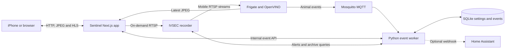

# IVSEC Sentinel

IVSEC Sentinel is a local, mobile-focused security camera console for an IVSEC network video recorder. It provides live camera viewing, continuously refreshed camera snapshots, recorder alert history, local animal detection, and optional Home Assistant notifications.

The system is designed to run on a Linux computer on the same trusted network as the IVSEC recorder. 

## Project status

The current application supports:

- One-second dashboard snapshots from the recorder's low-bandwidth streams.
- On-demand browser playback of live RTSP streams through H.264 HLS.
- IVSEC recorder alert collection, history, and local clearing.
- Local animal detection using Frigate, OpenVINO, and MegaDetector V6.
- Per-camera confidence, object-area, movement, and enablement controls.
- Animal event snapshots, acknowledgement, retention, and clearing.
- Optional Home Assistant webhook delivery with retries and camera cooldowns.
- Intel GPU detection on Linux with an automatic CPU fallback.

Direct playback of recorder footage associated with an IVSEC alert, PTZ controls, audio, ONVIF management, and application authentication are not implemented yet.

## How it works



There are four main data paths:

1. **Live cameras:** Next.js starts or reuses an FFmpeg process when a camera is opened. FFmpeg reads the IVSEC RTSP stream, converts H.265 to browser-compatible H.264, and produces a short-lived HLS playlist.
2. **Dashboard snapshots:** Frigate continuously reads the mobile streams. Next.js proxies Frigate's latest JPEG for each camera, avoiding a separate FFmpeg process for every thumbnail.
3. **Animal detection:** Frigate runs the local MegaDetector model and publishes object events through MQTT. The Python worker applies per-camera confidence, area, movement, and cooldown rules, then stores accepted event metadata in SQLite. Event snapshots stay in Frigate.
4. **IVSEC alerts:** The Python worker authenticates to the recorder, backfills alert-class recordings, and follows live recorder events. These alerts are separate from Frigate animal detections.

Animal detection starts in shadow mode. Events appear in Sentinel, but Home Assistant notifications remain disabled until a webhook is configured, tested, and enabled in the Animals screen.

More implementation detail is available in [the architecture guide](sentinel_web/architecture.md) and [the Sentinel application README](sentinel_web/README.md).

## Repository layout

| Path | Purpose |
| --- | --- |
| [`sentinel_web/`](sentinel_web/) | Next.js application, API routes, Docker stack, Frigate setup, MQTT configuration, and animal worker. |
| [`IVSEC_FINDINGS.md`](IVSEC_FINDINGS.md) | Read-only recorder API, RTSP, playback, event, and ONVIF investigation notes. Contains no live credentials. |
| [`onvif_pullpoint_probe.py`](onvif_pullpoint_probe.py) | Command-line probe for testing ONVIF pull-point event subscriptions. Credentials are supplied as arguments. |
| [`ivsec_webhook_listener.py`](ivsec_webhook_listener.py) | Small development listener for examining IVSEC webhook requests. Its generated JSONL output is ignored by Git. |
| [`.gitignore`](.gitignore) | Excludes credentials, dependencies, virtual environments, compiled files, and local runtime output. |

## Camera layout

| Channel | Name | Initial state |
| --- | --- | --- |
| 01 | Front Door | Active |
| 02 | Backyard - Up | Previously offline |
| 03 | Pool | Active |
| 04 | Garage | Active, detection can be controlled separately |
| 05 | Front Drive | Active |
| 06 | Backyard - Down | Active |
| 07 | Boat Shed | Previously offline |
| 08 | Side Passage | Active |

The application uses stream index `0` for on-demand live playback and stream index `2` for dashboard snapshots and animal detection by default.

## Configuration

Configuration belongs in `sentinel_web/.env.local`. Create it from the committed example:

```sh
cd sentinel_web
cp .env.example .env.local
chmod 600 .env.local
```

Then set the values needed for the deployment:

| Variable | Purpose |
| --- | --- |
| `IVSEC_HOST` | LAN address of the IVSEC recorder. |
| `IVSEC_USERNAME` | Recorder username. |
| `IVSEC_PASSWORD` | Recorder password. |
| `IVSEC_HISTORY_DAYS` | Number of recorder alert-history days to backfill, from 1 to 30. |
| `IVSEC_STREAM_INDEX` | RTSP stream used for live playback; normally `0`. |
| `IVSEC_SNAPSHOT_STREAM_INDEX` | Lower-bandwidth stream used by Frigate; normally `2`. |
| `FRIGATE_OPENVINO_DEVICE` | `AUTO`, `GPU`, or `CPU`. `AUTO` prefers an available Intel accelerator. |
| `SENTINEL_PUBLIC_URL` | LAN URL used by the iPhone and included in optional alert links. |
| `HA_ANIMAL_WEBHOOK_URL` | Optional Home Assistant webhook. Leave empty to keep alerts off. |
| `DEV_ALLOWED_ORIGINS` | Optional LAN host allowed to access the Next.js development server. |

Do not commit `.env.local`. It is excluded by both Git and the Docker build context.

## Develop on macOS

The Next.js interface requires Node.js 22 or newer. Running only the development server does not start Frigate, MQTT, or the Python worker.

```sh
cd sentinel_web
npm ci
npm run dev
```

Open <http://localhost:3000>. To test from an iPhone, use the Mac's LAN address and set `DEV_ALLOWED_ORIGINS` if Next.js rejects the development origin.

For the complete stack on a Mac with Docker Desktop:

```sh
cd sentinel_web
npm run docker
```

macOS does not expose Linux `/dev/dri`, so the startup script selects the CPU Compose overlay. This is suitable for development and functional testing; measure sustained detector performance on the target Linux server.

## Deploy on Linux

Install Docker Engine and the Docker Compose plugin, clone this repository onto the Linux server, and create `sentinel_web/.env.local`. Build on Linux so Docker selects the correct platform and can access the host's Intel GPU.

With Node.js 22 available on the host, the project launcher automatically selects GPU or CPU mode:

```sh
cd sentinel_web
npm run docker
```

Node.js is not required on the host when Compose is invoked directly. On a Linux server with `/dev/dri/renderD128`:

```sh
cd sentinel_web
docker compose up -d --build --remove-orphans
```

For a server without that device, use the CPU overlay:

```sh
docker compose \
  -f compose.yaml \
  -f compose.cpu.yaml \
  up -d --build --remove-orphans
```

The first start needs internet access to pull container images and download the pinned detector bundle. The model is checksum-verified and retained in a Docker volume, so later starts can run locally.

Give the Linux server a stable LAN address, set `SENTINEL_PUBLIC_URL` to `http://SERVER-LAN-IP:3000`, and open that address from the iPhone.

### Updating the server

```sh
cd /path/to/ivsec
git pull --ff-only
cd sentinel_web
docker compose up -d --build --remove-orphans
docker compose restart frigate
```

Restarting Frigate ensures any regenerated detector configuration is loaded.

## Docker services and storage

The Compose stack contains:

| Service | Responsibility |
| --- | --- |
| `sentinel` | Next.js website, API routes, snapshot proxy, and live HLS transcoding. |
| `frigate` | Continuous camera readers, OpenVINO inference, tracking, and animal snapshots. |
| `mqtt` | Internal Mosquitto message broker for detector events and controls. |
| `animal-alert-worker` | SQLite persistence, detector rules, IVSEC alerts, retention, and optional webhooks. |
| `model-init` | One-shot model preparation and Frigate configuration generation. |

Persistent Docker volumes hold:

- `animal-data`: SQLite event history and settings.
- `animal-models`: the prepared detector model.
- `frigate-config`: generated Frigate configuration.
- `frigate-media`: retained animal snapshots and Frigate media.

Rebuilding containers preserves these volumes. Running `docker compose down -v` deletes them.

## Operation and diagnostics

When Node.js is installed on the host, the provided commands are:

```sh
cd sentinel_web

npm run docker:status
npm run docker:check
npm run docker:stream-check -- 01
npm run docker:animals-check
npm run docker:logs
```

Direct Docker equivalents include:

```sh
docker compose ps
docker compose logs --tail=100 sentinel frigate animal-alert-worker mqtt
curl -fsS http://127.0.0.1:3000/api/health
```

A healthy web container and configured credentials do not prove that the recorder is reachable. Opening a real camera or running the stream check exercises the full recorder-to-browser path.

## Development checks

Run these from `sentinel_web`:

```sh
npm run lint
npm run typecheck
npm run build
npm run animal-worker:test
npm test
```

Playwright needs a compatible browser installed before the UI tests can run.

## Security

Sentinel currently has no application login. Anyone who can reach port 3000 can view cameras and use the interface, so keep it on a trusted LAN and do not expose the port directly to the internet. Use a private VPN if remote access is required.

Recorder credentials remain server-side and are not returned to the browser. At runtime, the generated Frigate configuration and RTSP/FFmpeg process arguments can contain embedded recorder credentials, so Docker and root access to the host must be limited to trusted administrators.

The recorder integration is intended to be read-only. Clearing IVSEC alerts removes Sentinel's local copies; it does not delete recorder footage or recorder-side events. Clearing animal events removes Sentinel metadata and corresponding Frigate event snapshots without changing detector settings.

## Recorder research utilities

The scripts in the repository root are development tools rather than required production services.

To try the ONVIF pull-point probe:

```sh
python3 -m venv .venv
source .venv/bin/activate
pip install requests

python onvif_pullpoint_probe.py \
  --host RECORDER-LAN-IP \
  --username RECORDER-USERNAME \
  --password RECORDER-PASSWORD
```

Command-line arguments may be visible to other privileged users in the process list. Use the tool only on a trusted development machine.

To capture webhook requests during recorder research:

```sh
python ivsec_webhook_listener.py --host 0.0.0.0 --port 8123
```

Captured request bodies and headers are written to `ivsec_webhook_events.jsonl`. That file is intentionally ignored because captured traffic may contain sensitive data.
