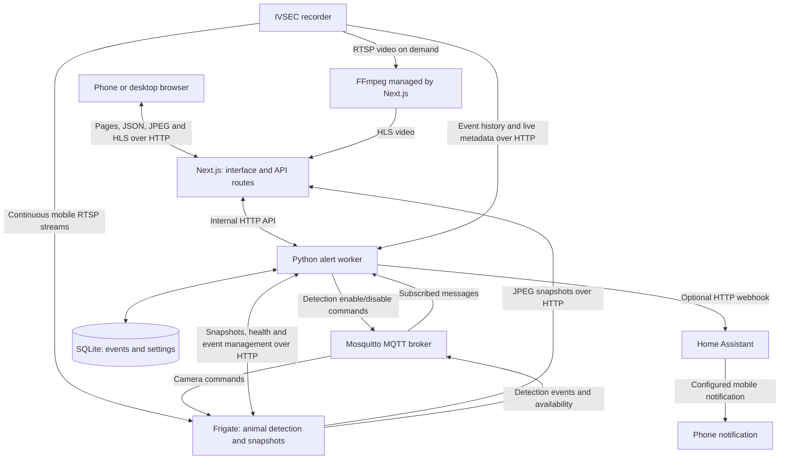

# SENTINEL architecture

SENTINEL is a local camera dashboard. **Next.js provides the website and its API endpoints, Frigate detects animals, MQTT carries detection messages and commands, and a Python worker stores events and sends optional alerts.** The IVSEC recorder supplies camera video and its own event history.

This guide describes the implementation in this repository, rather than confirming that every service is currently running.

## How the pieces connect

## What each part does

| Part | Role in this app | Main code/configuration |
| --- | --- | --- |
| Next.js + React | Renders the dashboard, player, Animals and System screens. Its server-side route handlers expose `/api/...` to the browser. | `app/`, `components/` |
| Next.js APIs | Connect browser requests to video processing, Frigate or the Python worker. Keep recorder credentials on the server. | `app/api/`, `lib/` |
| FFmpeg | Converts recorder RTSP video into browser-compatible H.264 HLS playlists and segments when a camera is opened. | `lib/stream.ts` |
| Frigate | Continuously reads six configured camera mobile streams, runs MegaDetector through OpenVINO, and keeps animal snapshots. Video recording is disabled in the generated configuration. | `services/model-init/install.py` |
| MQTT / Mosquitto | A message broker: Frigate publishes events; the worker subscribes. The worker also publishes detection enable/disable commands. MQTT carries small messages, not video. | `services/mqtt/mosquitto.conf` |
| Python alert worker | Consumes animal events, applies alert rules and cooldowns, persists settings/history, collects IVSEC events, and optionally calls Home Assistant. Exposes an internal HTTP API. | `services/animal-worker/worker.py` |
| Model installer | Runs at startup to install and prepare the pinned detector model and generate Frigate configuration. | `services/model-init/` |
| IVSEC recorder | Supplies RTSP streams and recorder-generated event metadata. Existing recorder footage stays on the recorder. | External hardware |

## The main flows

### 1. Viewing a live camera

The browser requests `/api/stream/[channel]/[file]`. Next.js starts or reuses an FFmpeg process that reads the recorder's configured RTSP stream and produces HLS video. The browser plays it using hls.js or native Safari HLS.

This path runs independently of Frigate and MQTT. Next.js shares up to four active transcoders and expires idle streams. HLS adds several seconds of delay.

### 2. Showing dashboard thumbnails

The browser requests `/api/snapshot/[channel]`. Next.js fetches the latest JPEG from Frigate's HTTP API. This reuses Frigate's continuous camera readers. If Frigate is offline, thumbnails become unavailable even though live playback can still work.

### 3. Detecting an animal

Frigate reads the configured mobile streams at two detection frames per second and publishes object events to `frigate/events` through MQTT. The worker subscribes to those events and `frigate/available`, applies its rules, and stores event metadata in SQLite. Snapshot images remain in Frigate.

The Animals screen fetches events through Next.js. Alerts start in shadow mode: detections are visible, but automatic Home Assistant delivery requires a configured webhook and enabled alerts. The worker applies the per-camera cooldown before retaining a new incident, so shadow mode and live alerts share the same history rate limit. It also handles webhook delivery retries.

Changing a camera's detection toggle travels from the browser through the Next.js API to the worker, which saves the setting and publishes a retained `frigate/<camera>/detect/set` MQTT command.

### 4. Showing IVSEC recorder alerts

The same Python worker authenticates to the recorder using HTTP Digest, then uses the recorder's session and CSRF token. It backfills event history and polls for live event metadata through the recorder's HTTP API. These events also live in SQLite and reach the browser through `/api/ivsec/events`.

These are recorder-generated alerts, separate from Frigate's animal detections. Opening an IVSEC alert currently opens that camera's live view; direct playback of its recorder footage is not implemented.

## Where the APIs fit

An API is the request interface between components. There are several here:

| API | Caller → server | Purpose |
| --- | --- | --- |
| Next.js `/api/stream/...`, `/api/snapshot/...`, `/api/health` | Browser → Next.js | Live video, thumbnails and status |
| Next.js `/api/animals/...`, `/api/ivsec/events` | Browser → Next.js | Event lists, settings, acknowledgement, clearing and test alerts |
| Worker `/events`, `/settings`, `/ivsec-events`, `/health` | Next.js → Python worker | Event storage, controls and service status |
| Frigate `/api/...` | Next.js or worker → Frigate | Images, detector status and event management |
| IVSEC `/API/...` | Worker → recorder | Authentication, archive searches and live event polling |
| Home Assistant webhook | Worker → Home Assistant | Optional notification handoff |

The browser talks to Next.js. Next.js routes requests to the appropriate internal service. MQTT complements those HTTP APIs by distributing asynchronous events and commands.

## Deployment and storage

`compose.yaml` runs five services on one Docker network: `sentinel`, `frigate`, `mqtt`, `animal-alert-worker` and the one-shot `model-init`. Only Next.js port **3000** is published to the host. The worker uses internal port **3101**, Frigate HTTP uses **5000**, and MQTT uses **1883**.

Persistent Docker volumes hold SQLite data (`animal-data`), Frigate snapshots/media (`frigate-media`), generated configuration (`frigate-config`) and the detector model (`animal-models`). HLS files are temporary and live in the Sentinel container's `/tmp` memory filesystem.

The Linux host needs network access to the recorder and FFmpeg for live conversion. The startup script selects an Intel GPU configuration when available or a CPU fallback. Running only `npm run dev` starts Next.js; the other services must also be reachable for detection, event history and thumbnails.

The app currently has no application login and is intended for a trusted LAN. A successful app health response or configured credentials alone does not prove recorder connectivity; opening a real camera tests the live video path.
